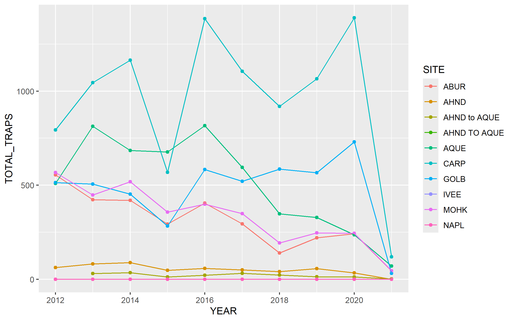

<<<<<<< HEAD
Data Citation: <https://portal.edirepository.org/nis/mapbrowse?packageid=knb-lter-sbc.77.8> This data was aquired April 20,2026

Abstract:

Owner Analysis: 

=======
## Data Source

The data were obtained from the Environmental Data Initiative (EDI) Data Portal, downloaded on April 20, 2026.

https://portal.edirepository.org/nis/metadataviewer?packageid=knb-lter-sbc.77.8

## Abstract Summary

This dataset tracks the abundance, size, and fishing pressure of California spiny lobster (*Panulirus interruptus*) along the Santa Barbara Channel. It includes long-term data from kelp forest sites both inside and outside Marine Protected Areas, allowing researchers to examine how fishing activity influences lobster populations and ecosystem dynamics.

## Owner Analysis and Visualization

## Collaborator Analysis and Visualization

![This line and point plot shows the total number of lobster traps recorded over time (2012–2021) across multiple sites. Each colored line represents a different site, allowing comparison of temporal trends in fishing activity. Overall, sites such as CARP and AQUE consistently show higher trap counts compared to others, indicating greater fishing pressure in those areas. Many sites exhibit fluctuations over time, with noticeable peaks around 2016 and 2020, suggesting periods of increased fishing activity. In contrast, some sites (e.g., AHND and related categories) maintain relatively low and stable trap counts throughout the study period. A sharp drop in trap counts is observed across nearly all sites in 2021, which may reflect incomplete data collection or a significant reduction in fishing activity during that year.](figs/lobster_line_plot.png){fig-cap="Figure: Lobster trap counts over time by site"}

## Summary
>>>>>>> 33743c042a1c6f5b7938a00c5dbf676dacf4c24a
